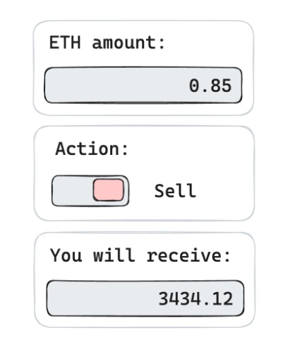

# USDT/ETH Price Fetcher

This application fetches the current price of the USDT/ETH pair from the Binance API. Users can enter the amount of ETH they want to trade and select whether they want to buy or sell the asset. The result will display the amount of USDT required to perform the selected action.

## Example UI
(Do not copy it; it's for reference only)

## General Technical Requirements

- Implemented in TypeScript.
- Utilizes React as the frontend library.
- Upload the result to a public Git repository.
